## Documentation

__Always prefer Harmony's [official documentation](https://chsakell.gitbook.io/harmony/) which always contain the latest docs.__

### Set database connection string
Open __appsettings.json__ and set the connection string to point to your SQL Server instance
```javascript
  "ConnectionStrings": {
    "DefaultConnection": "Server=.;Database=Harmony;Integrated Security=True;TrustServerCertificate=True"
  },
```

### Database migrations
By default, when you start the application, the app will try to run all migrations to your database. You can of course disable this for production environment. You can also run migrations using the command line. Check the __migrations.pdf__ for sample commands.

### Start application
Set the `Harmony.Server` project as the startup and fire up the application

### Default users created
By default two users will be created for you:
1. username: __administrator__ , password: __Pa$$w0rd!__
2. username: __johndoe__ , password: __Pa$$w0rd!__

You can use both of them but you can register your own of course. Make sure you change the administrator's password in a production environment from the account page.

### Register account

Click `Register` and fill all the required fields
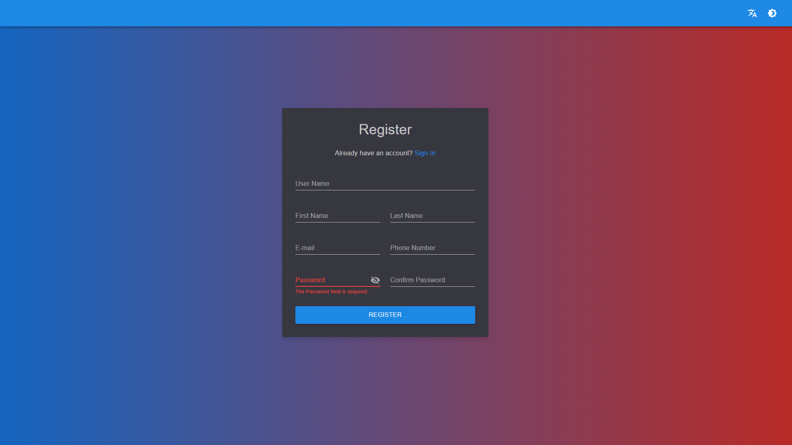

### Login
Click `Sign In` and enter your credentials
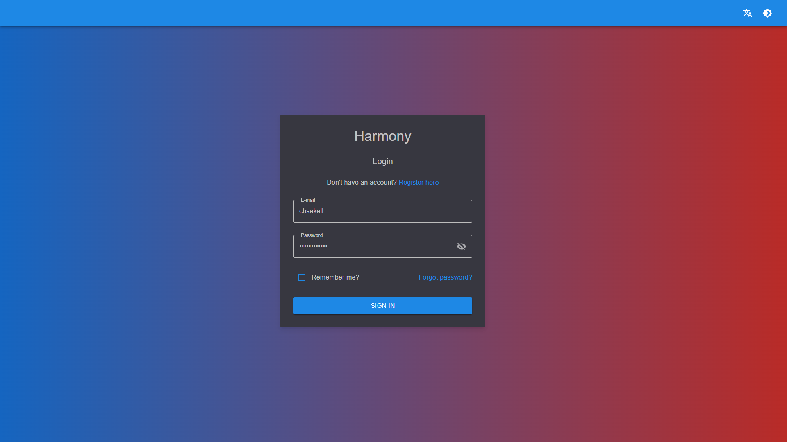

### Create a workspace
From the upper right click `CREATE` and select `Create Workspace`. Or you can click the `START NOW` button on the Home page
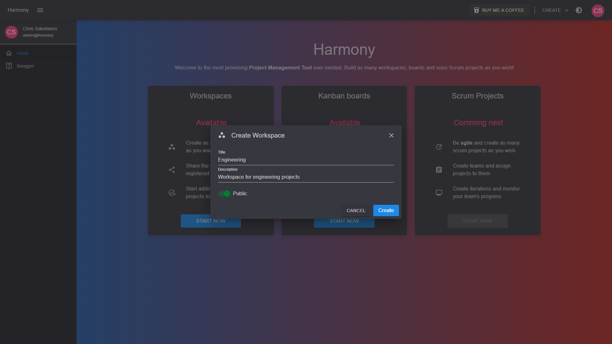

### Add members to a workspace
With an __administrator__ account click the `Members` menu item on the left menu. Search and add/remove members to the workspace
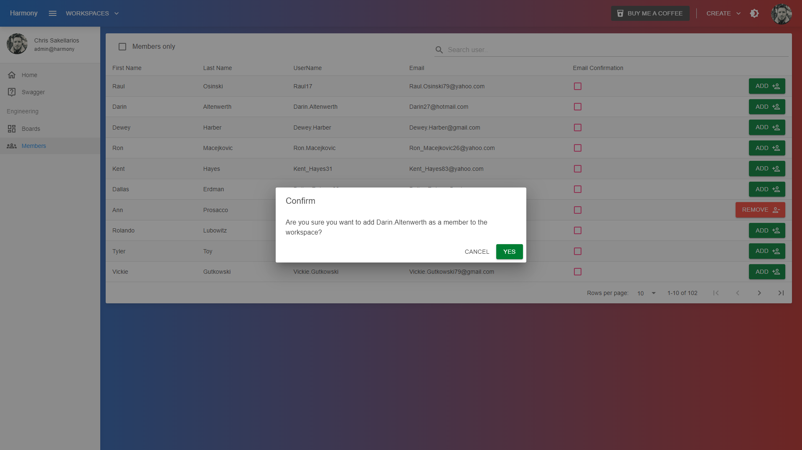


### Add a board or a scrum project
From the upper right click `CREATE` and select `Create Board`. Or you can click the `START NOW` button on the empty's workspace page
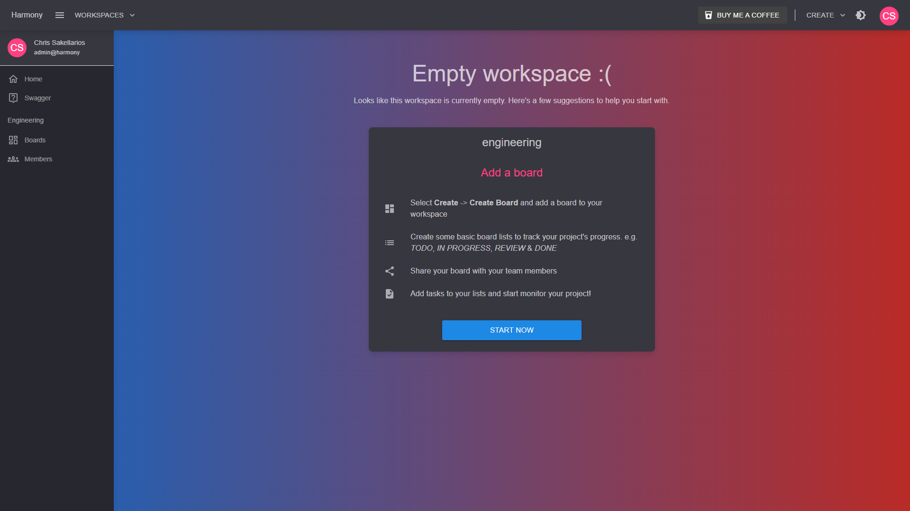
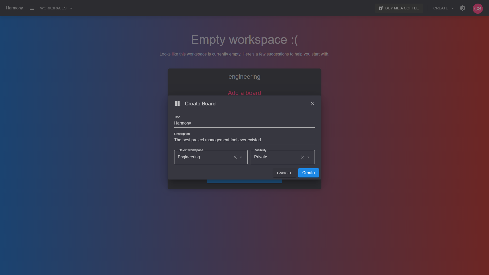
Select the board's workspace and click `Create`.

### Add members to a board
Click the `SAHRE BOARD` button on the top right of the board's top bar.


### Add board lists to your board
Customize your own board by creating a few lists, e.g _TODO_, _IN PROGRESS_, _COMPLETE_. Click `CREATE LIST` from the top bar in the board's page or the `START NOW` button on an empty board.
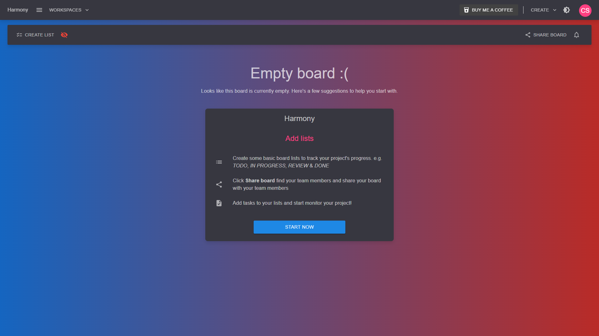
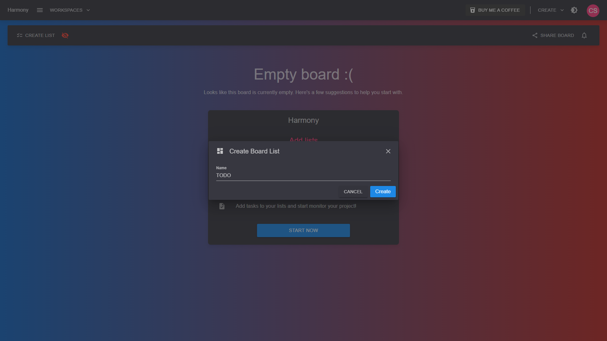

### Add cards to your board
Click the __+__ button at the top of a board list and enter the card's title.
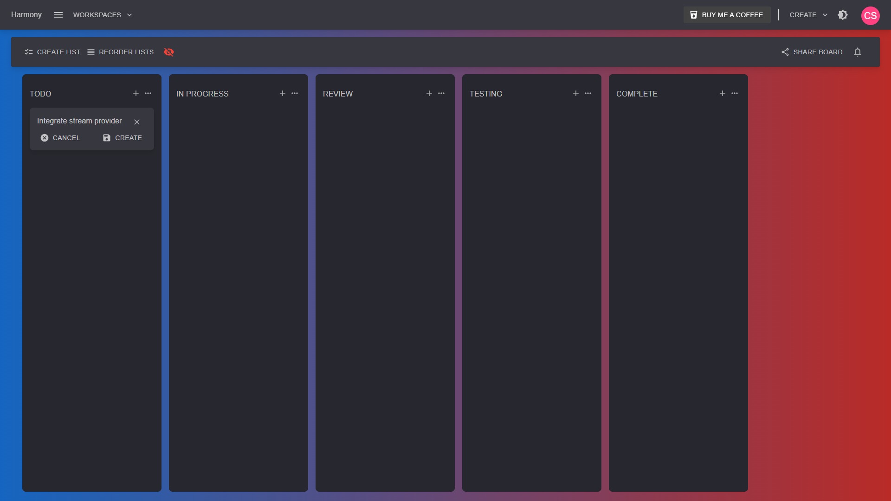

### View card
Simply click on a card to open its contents. In the card's view you can:

1. Add set a description
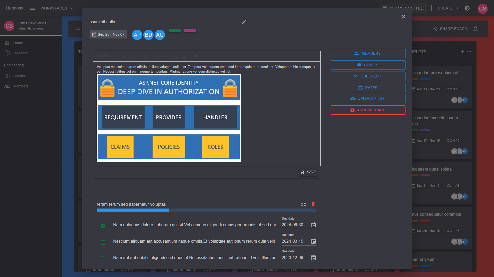

2. Set multiple labels or even create new ones
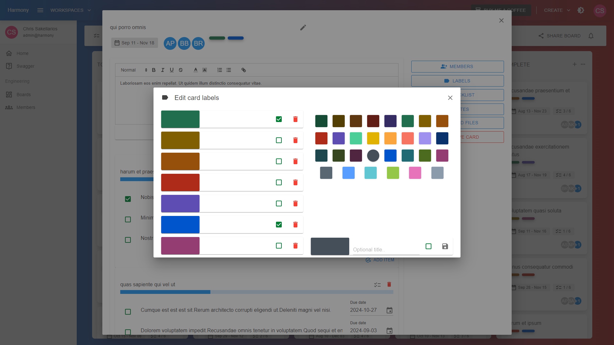

3. Set start/due dates
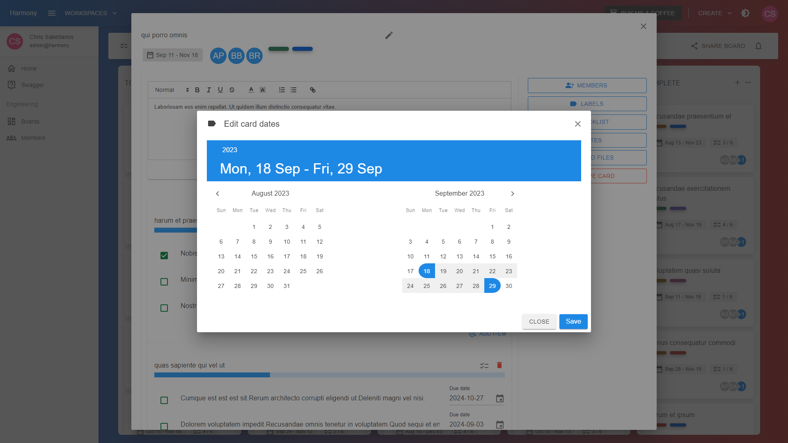

4. Create check lists
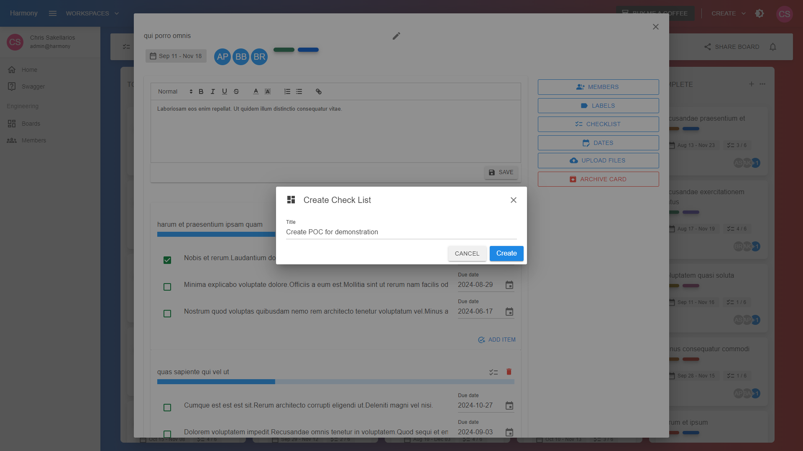

5. Add check list items to check lists
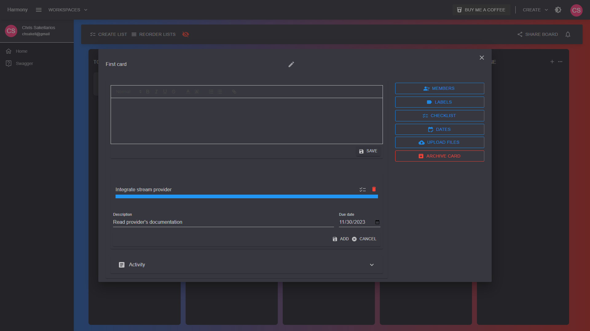
You can also set a due date for each item

6. Assign member(s) to a card
Click the `MEMBERS` button on the right and add members to the card
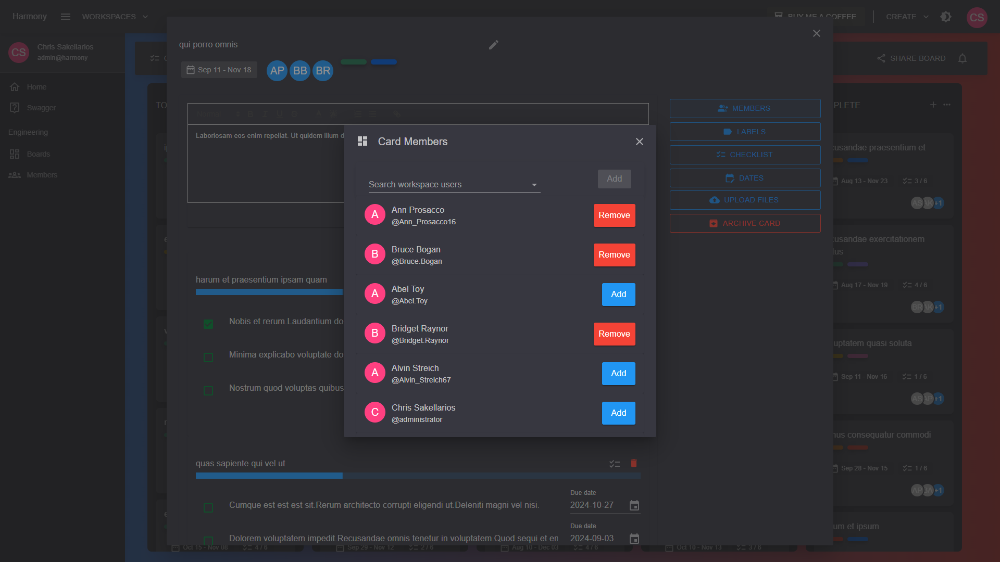

### Account
Selec `Account` from the right top bar. Update user's details and set a profile picture for your account
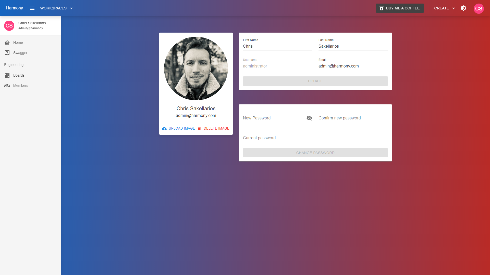

### Dark/Light theme
Toggle the site's theme using the upper right button
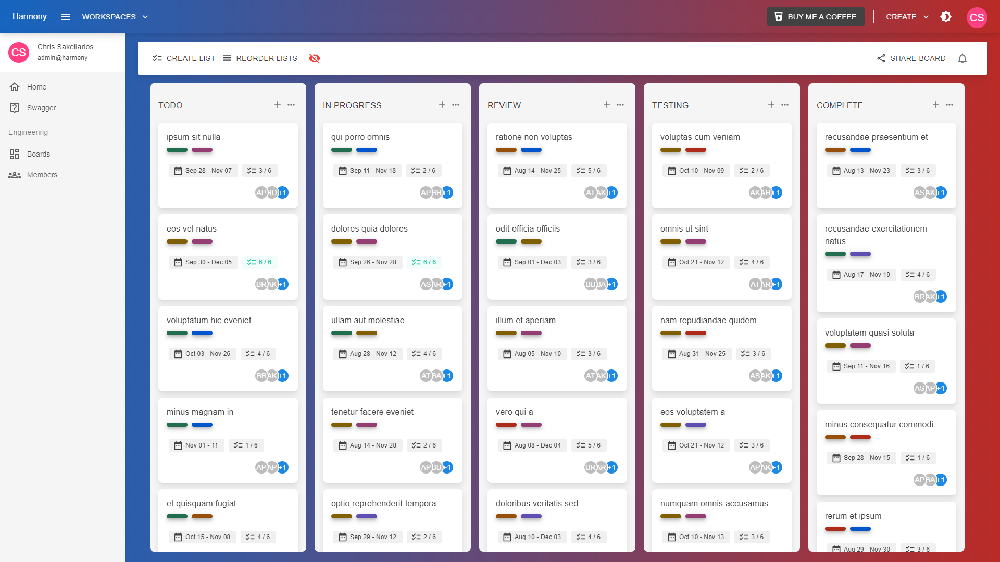